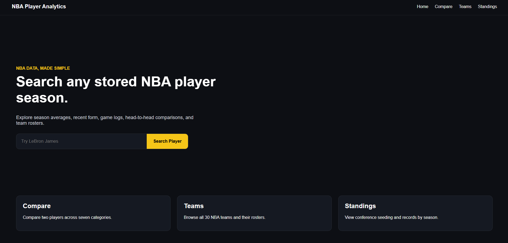
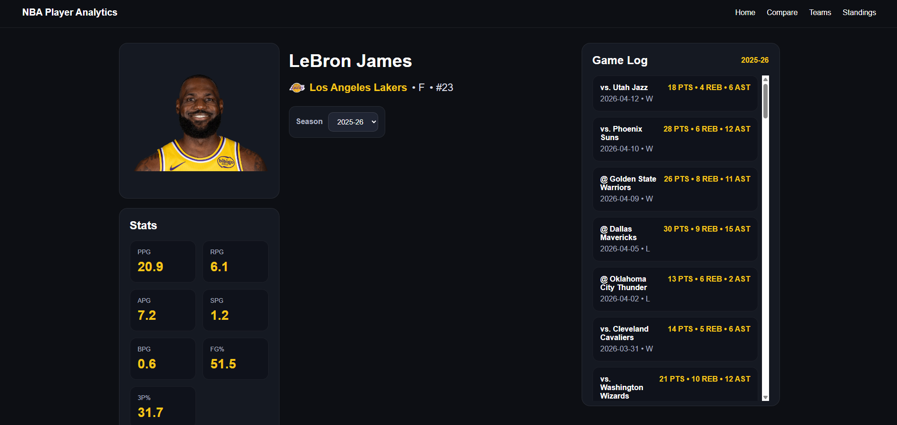
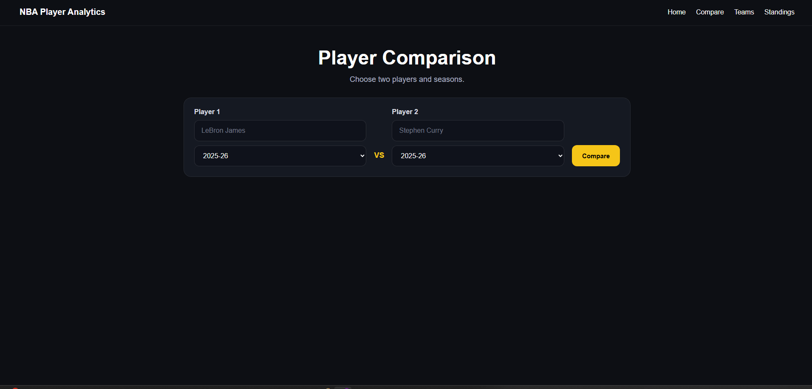
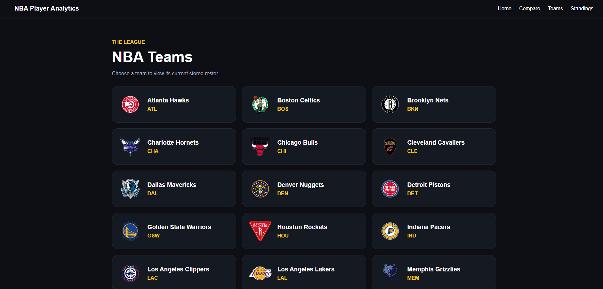
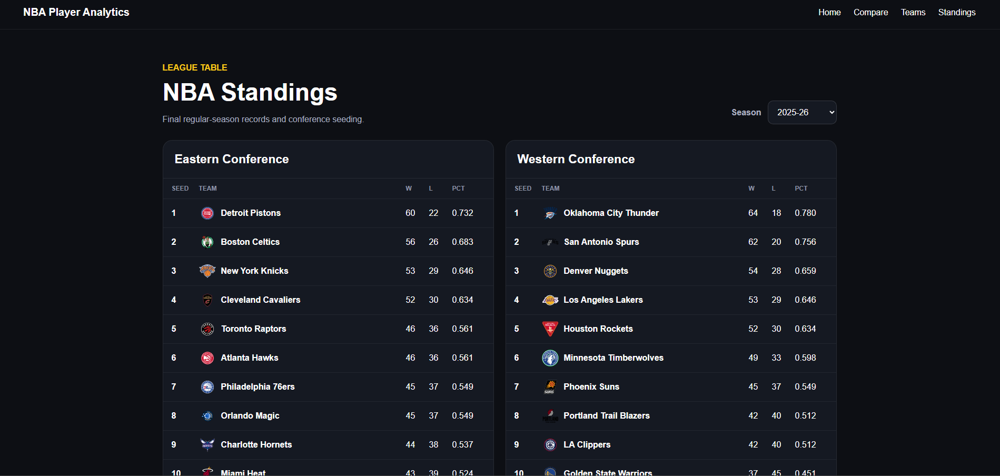

# NBA Player Analytics

A Flask web application for exploring historical NBA player statistics, comparing players, browsing team rosters, and viewing conference standings.

The application reads from a compact SQLite database, so normal page requests do not depend on a live statistics API.

## Screenshots

### Player Search



### Player Statistics



### Player Comparison



### NBA Teams



### Conference Standings



## Features

- Search NBA players by name
- View player season averages and game logs
- Select historical seasons from the downloaded data
- Compare two players across seven statistical categories
- Browse a directory of all 30 NBA teams
- View team rosters with links to player pages
- View Eastern and Western Conference standings
- Switch standings between available seasons
- Read production data from SQLite instead of requesting live data for every page

## Technology

- Python
- Flask
- SQLite
- Pandas
- HTML and CSS
- Jinja
- Gunicorn
- Render

## Running the Project Locally

### Requirements

- Python 3
- Git

### Installation

1. Clone the repository:

```bash
git clone https://github.com/shakir333/nba-stat-analyzer.git
```

2. Enter the project folder:

```bash
cd nba-stat-analyzer
```

3. Create a virtual environment:

```bash
py -m venv .venv
```

4. Activate the virtual environment in Windows PowerShell:

```powershell
.\.venv\Scripts\Activate.ps1
```

5. Install the required packages:

```bash
py -m pip install -r requirements.txt
```

6. Start the Flask application:

```bash
py app.py
```

7. Open the application in your browser:

```text
http://127.0.0.1:5000
```

The included `data/nba_stats.db` database is sufficient to run the application. You do not need to rebuild the data first.

## Architecture

```text
Kaggle CSV files
       ↓
 update_data.py
       ↓
 SQLite database
       ↓
  Flask routes
       ↓
 Jinja templates
```

- `update_data.py` imports and processes the historical NBA data.
- `data/nba_stats.db` stores the deployable data used by the application.
- `app.py` defines the Flask routes.
- `stats_helper.py` handles player and team data queries.
- `compare.py` processes player comparisons.
- Jinja templates render the application pages.
- Normal website requests read from SQLite instead of repeatedly calling an external statistics API.

## Project Structure

```text
nba-stat-analyzer/
├── app.py
├── compare.py
├── stats_helper.py
├── update_data.py
├── requirements.txt
├── data/
│   └── nba_stats.db
├── static/
│   ├── css/
│   │   └── style.css
│   └── images/
│       └── readme/
└── templates/
    ├── index.html
    ├── player.html
    ├── compare.html
    ├── teams.html
    ├── team.html
    ├── standings.html
    └── 404.html
```

## Rebuilding the Data

Rebuilding the database is optional. The database included in the repository is already ready for normal local use and deployment.

Download the following CSV files from the Kaggle **Historical NBA Data and Player Box Scores** dataset:

- `PlayerStatistics.csv`
- `Players.csv`
- `TeamHistories.csv`

Create a local folder named `kaggle_data` in the project and place the three CSV files inside it:

```text
nba-stat-analyzer/
└── kaggle_data/
    ├── PlayerStatistics.csv
    ├── Players.csv
    └── TeamHistories.csv
```

Stop the Flask server before rebuilding the database. Then run:

```bash
py update_data.py
```

By default, the importer builds the database for the ten-season range from `2016-17` through `2025-26`.

To choose a different range, list the seasons explicitly:

```bash
py update_data.py --seasons 2023-24 2024-25 2025-26
```

The importer replaces `data/nba_stats.db` only after completing a successful build.

The original Kaggle files are large, so `kaggle_data/` is ignored by Git and should not be committed.

## Deployment

The production start command is:

```bash
gunicorn app:app
```

The compact SQLite database must be committed with the project so the deployed application can access the stored statistics.

The updater should be run locally and should not be included in the web-service start command.

## Current Limitations

- The database must be rebuilt to include newly completed games or seasons.
- The application does not include user accounts or personalized features.
- Automated tests and continuous integration are potential future improvements.